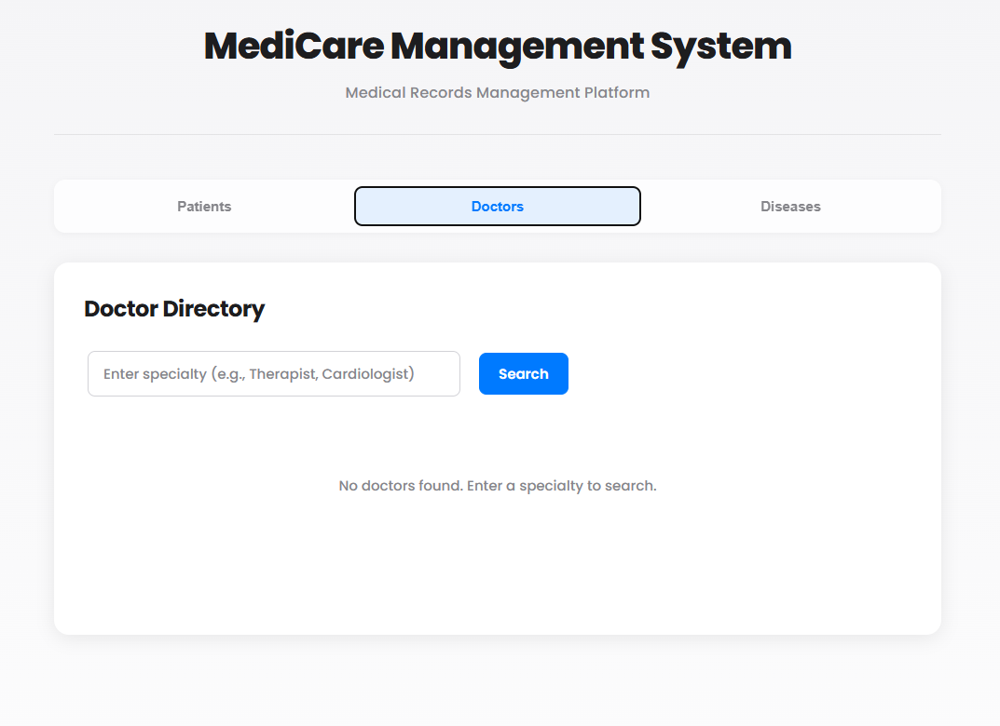
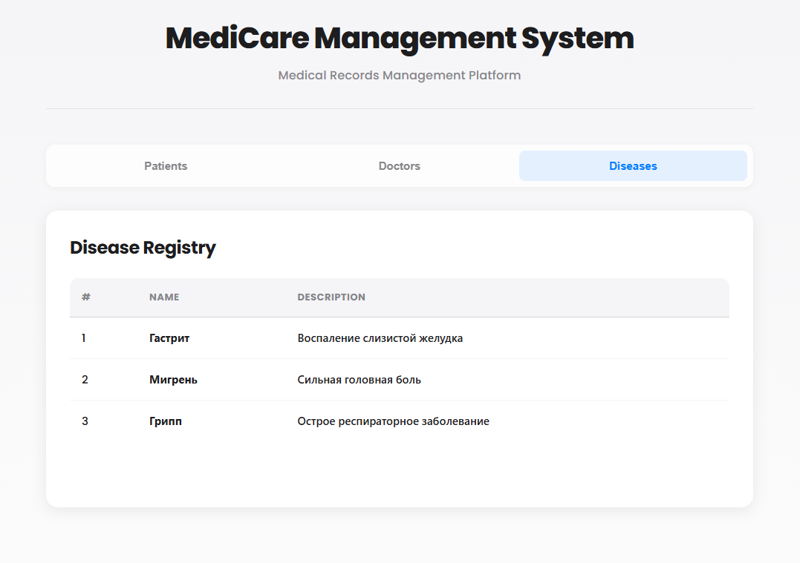

# 🏥 MediCare Management System

<div align="center">


**Система управления медицинскими записями с чистой архитектурой**

[Особенности](#-особенности) • [Технологии](#-технологии) • [Установка](#-установка) • [Скриншоты](#-скриншоты) • [Примеры кода](#-примеры-кода)

</div>

---

## 📋 О проекте

Веб-приложение для управления медицинскими записями. Показывает как я умею строить приложения с правильной архитектурой — разделение на слои, работа с базой данных, REST API и современный фронтенд.

**Что умеет:**
- Просмотр и редактирование пациентов
- Поиск докторов по специальности
- Справочник болезней
- REST API с документацией Swagger
- Современный интерфейс на React

---

## ✨ Особенности

**Архитектура:**
- Разделение на слои (Domain, Application, Infrastructure, API)
- Использование Value Objects для валидации данных
- Repository Pattern для работы с базой
- Dependency Injection везде

**Backend:**
- ASP.NET Core 9.0
- Entity Framework Core с SQLite
- Swagger для документации API
- Автоматическое заполнение тестовыми данными

**Frontend:**
- React 19 с TypeScript
- Современный дизайн в стиле macOS
- Компонентная архитектура

---

## 🛠️ Технологии

**Backend:**
- ASP.NET Core 9.0
- Entity Framework Core 9.0
- SQLite
- Swagger/OpenAPI

**Frontend:**
- React 19.2
- TypeScript 5.9
- Vite 7.2

---

## 🏛️ Архитектура

Проект разделен на слои:

1. **Domain** — сущности (Patient, Doctor, Disease) и Value Objects (FullName)
2. **Application** — бизнес-логика в сервисах
3. **Infrastructure** — работа с базой данных через EF Core
4. **API** — REST контроллеры
5. **Client** — React приложение

Каждый слой знает только о том, что ему нужно, зависимости идут сверху вниз.

---

## 🚀 Установка

**Требования:**
- .NET 9.0 SDK
- Node.js 18+
- npm

**Запуск:**

1. Клонируйте репозиторий
```bash
git clone https://github.com/D4cLoves/MediCareManagementSystem.git
cd MediCareManagementSystem
```

2. Запустите Backend
```bash
cd TestTask_API
dotnet restore
dotnet ef database update
dotnet run
```

3. В другом терминале запустите Frontend
```bash
cd TestTask_Client
npm install
npm run dev
```

**Результат:**
- API: `http://localhost:5119`
- Swagger: `http://localhost:5119/swagger`
- Frontend: `http://localhost:5173`

При первом запуске база автоматически заполнится тестовыми данными (8 докторов, 12 пациентов, 8 болезней).

---

## 📸 Скриншоты

### Реестр пациентов

<div align="center">
  
</div>

Список всех пациентов с возможностью редактирования имени прямо в таблице.

### Поиск докторов

<div align="center">
  
</div>

Поиск докторов по специальности. Введите название специальности и получите список подходящих врачей.

### Справочник болезней

<div align="center">
  
</div>

Полный каталог болезней с описаниями для быстрого доступа к информации.

---

## 💻 Примеры кода

### 1. Value Object — валидация на уровне домена

```csharp
public class FullName
{
    public string Value { get; }

    public static FullName Create(string value)
    {
        if (string.IsNullOrWhiteSpace(value))
            throw new ArgumentException("ФИО не может быть пустым");

        var trimmed = value.Trim();
        if (trimmed.Length < 2)
            throw new ArgumentException("Слишком короткое имя");

        return new FullName(trimmed);
    }
}
```

**Что это дает:**
- Валидация данных в одном месте — нельзя создать невалидное ФИО
- Бизнес-правила инкапсулированы в доменной модели
- Невозможно случайно передать пустую строку вместо имени

---

### 2. Entity с инкапсуляцией — защита данных

```csharp
public class Patient 
{
    public Guid Id { get; private set; }
    public FullName Name { get; private set; }
    public DateTime BirthDate { get; private set; }

    private Patient(){} // Для EF Core
    
    public Patient(FullName name, DateTime birthDate, Guid doctorId)
    {
        Id = Guid.NewGuid();
        Name = name;
        BirthDate = birthDate;
        DoctorId = doctorId;
    }
    
    public void UpdateName(FullName newName) => Name = newName;
}
```

**Что это дает:**
- Приватные сеттеры — нельзя изменить данные напрямую, только через методы
- Конструктор гарантирует, что объект создается с валидными данными
- Методы обновления контролируют изменения состояния

---

### 3. EF Core конфигурация — Value Object в базе

```csharp
modelBuilder.Entity<Patient>()
    .Property(p => p.Name)
    .HasConversion(
        v => v.Value,              // Как сохранить в БД
        v => FullName.Create(v))   // Как загрузить из БД
    .IsRequired();
```

**Что это дает:**
- Value Object автоматически конвертируется в строку при сохранении
- При загрузке автоматически создается валидный объект FullName
- База хранит простую строку, код работает с объектом

---

### 4. REST API контроллер — чистая архитектура

```csharp
[ApiController]
[Route("api/patients")]
public class PatientController : ControllerBase
{
    private readonly PatientService _patientService;

    public PatientController(PatientService patientService)
    {
        _patientService = patientService;
    }

    [HttpGet]
    public async Task<ActionResult<List<Patient>>> GetPatients()
    {
        var patients = await _patientService.GetPatients();
        return Ok(patients);
    }
}
```

**Что это дает:**
- Контроллер только принимает запросы и возвращает ответы
- Вся бизнес-логика в сервисе — легко тестировать и менять
- Dependency Injection через конструктор — зависимости явные

---

### 5. React компонент — TypeScript и хуки

```typescript
const PatientList: React.FC = () => {
    const [patients, setPatients] = useState<Patient[]>([]);
    const [editingId, setEditingId] = useState<string | null>(null);

    useEffect(() => {
        loadPatients();
    }, []);

    const loadPatients = async () => {
        const data = await api.getPatients();
        setPatients(data);
    };

    return (
        <div>
            <h2>Patient Registry</h2>
            {/* ... */}
        </div>
    );
};
```

**Что это дает:**
- TypeScript гарантирует типобезопасность — ошибки видны на этапе разработки
- React хуки для управления состоянием — современный подход
- Асинхронные операции через async/await — читаемый код

---

## 📁 Структура проекта

```
TestTask/
├── TestTask_API/              # REST API
├── TestTask_Application/      # Бизнес-логика
├── TestTask_Domain/          # Доменные модели
├── TestTask_Infrastructure/  # Работа с БД
├── TestTask_Client/          # React приложение
└── TestTask_AppHost/         # Aspire (опционально)
```

---

## 📝 API Endpoints

- `GET /api/patients` — список пациентов
- `GET /api/patients/{id}` — пациент по ID
- `PATCH /api/patients/{id}/name` — обновить имя
- `GET /api/doctors/specialty/{specialty}` — поиск докторов
- `GET /api/diseases` — список болезней

Документация: `http://localhost:5119/swagger`

---

## 🎯 Что показывает проект

**Архитектура:**
- Умение правильно разделять код на слои
- Понимание DDD подходов (Value Objects, Entities)
- Использование паттернов (Repository, Service Layer)

**Backend:**
- Работа с ASP.NET Core и EF Core
- Настройка REST API
- Работа с базой данных

**Frontend:**
- Современный React с TypeScript
- Компонентная архитектура
- Интеграция с API

**Качество кода:**
- Чистый, читаемый код
- Правильная организация файлов
- Типобезопасность

---

## 👨‍💻 Автор

**D4cLoves**

- GitHub: [@D4cLoves](https://github.com/D4cLoves)
- Проект: [MediCare Management System](https://github.com/D4cLoves/MediCareManagementSystem)

---

<div align="center">

**Сделано с ❤️ используя Clean Architecture**

⭐ Если проект был полезен, поставьте звезду!

</div>
